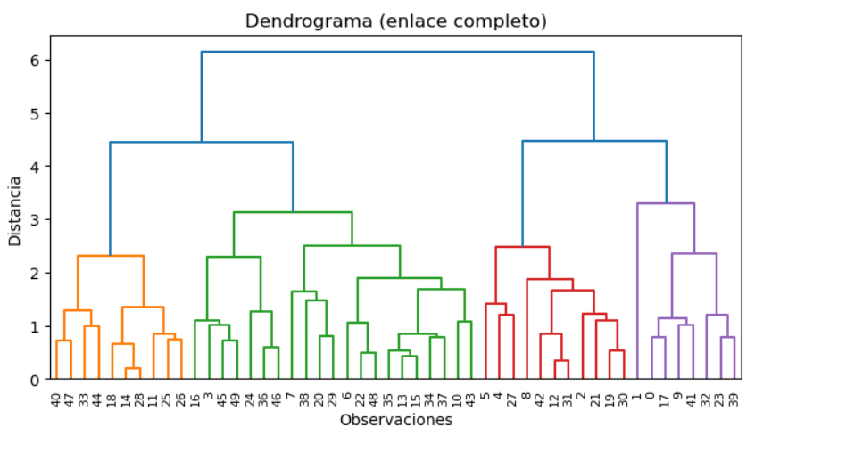
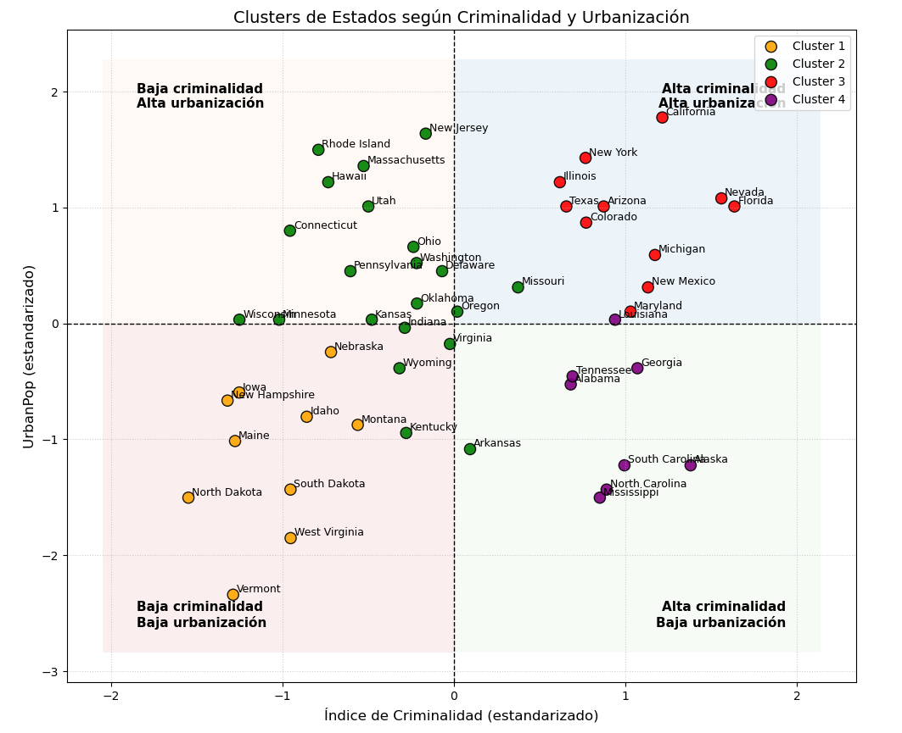
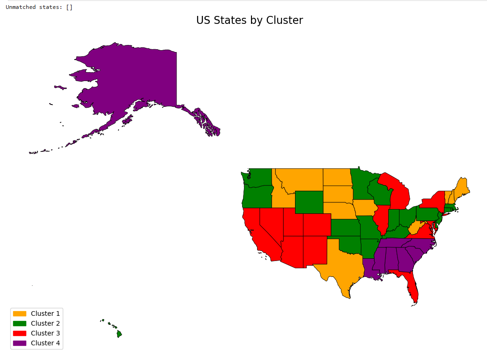
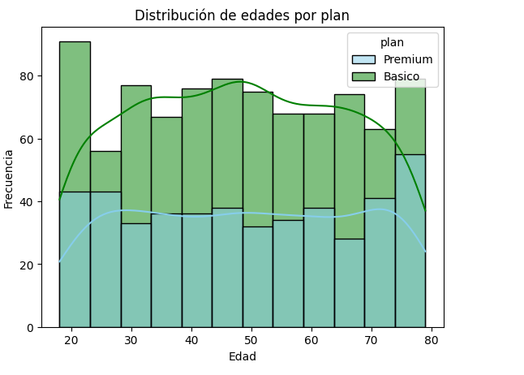
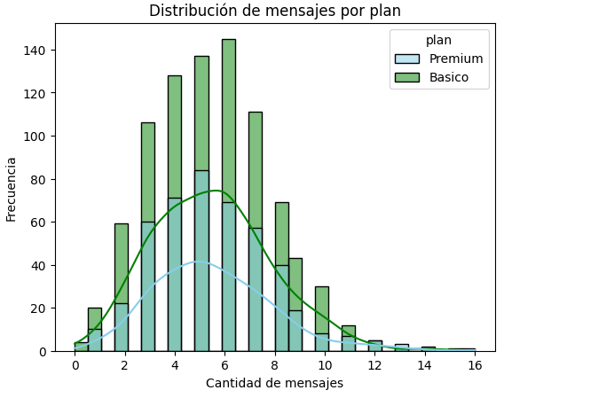
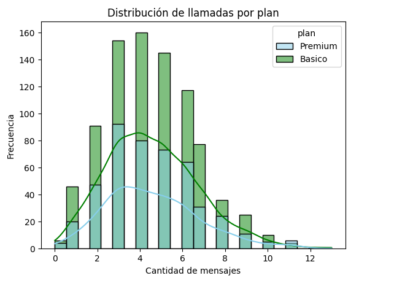
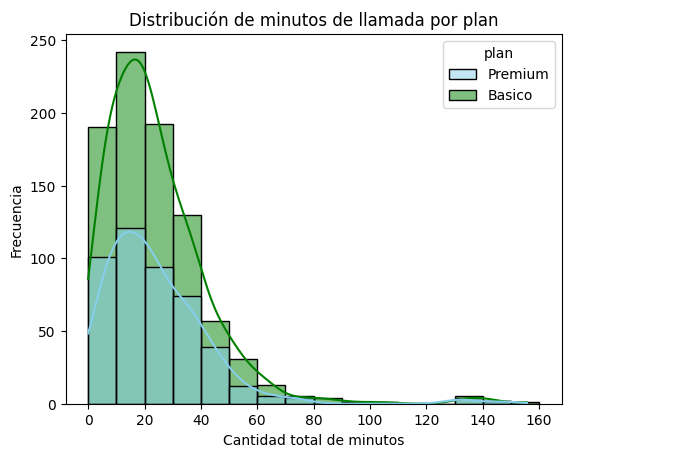

# 👨‍💻 Angel Felix Velarde | Portfolio


---

## 🎯 Portada

##Licenciado en Física / Physics Degree | Data Scientist | Data Analist 

Especializado en ciencia de datos, machine learning y análisis cuantitativo. Transformo datos complejos en soluciones prácticas e impactantes.

Diplomado en Estadística para Ciencia de datos.

---

## 📝 Sobre Mí

Soy licenciado en Física con un Diplomado en **Ciencia de Datos** y **Machine Learning**. Mi formación única combina:

- **Rigor Científico**: Simulaciones cuánticas, modelado computacional, física del estado sólido
- **Análisis de Datos**: Python, SQL, Machine Learning, estadística avanzada
- **Pensamiento Estratégico**: Resolución de problemas complejos con datos

### Mi Valor Único
Entiendo tanto la teoría matemática profunda como la aplicación práctica en industria. Puedo traducir problemas empresariales en modelos cuantitativos y soluciones de datos.

### Habilidades Técnicas

**Lenguajes:**
- Python (avanzado)
- SQL
- Inglés (B2)

**Machine Learning & Data Science:**
- Linear/Logistic Regression
- Clustering (K-means, Hierarchical)
- Feature Engineering
- Normalización & Scaling
- One-Hot Encoding

**Data Analysis:**
- Detección y tratamiento de outliers (Método IQR)
- Limpieza de valores nulos, sentinels y fechas inválidas
- Análisis de valores MAR (Missing At Random)
- Segmentación de clientes (Rule-based & demográfica)
- EDA (Exploratory Data Analysis)

**Herramientas & Librerías:**
- scikit-learn
- Pandas
- NumPy
- Matplotlib & Seaborn
- Streamlit (Web Apps)
- Jupyter Notebook

**Metodología:**
- EDA (Exploratory Data Analysis)
- Data Wrangling & Cleaning
- Model Evaluation & Metrics
- Git & Version Control

---

## 📂 Proyectos

### 1️⃣ Car Price Prediction - Machine Learning Model

**Descripción:**
Aplicación web que predice precios de automóviles semi-nuevos usando regresión lineal. Implementé el pipeline completo: limpieza de datos, feature engineering, normalización y despliegue en producción.

**Logros Principales:**
- Procesé 2,900+ registros de datos reales
- Creé 40+ características mediante One-Hot Encoding
- RMSE normalizado: ~0.15-0.20
- Aplicación activa en Streamlit Cloud

**Stack Tecnológico:**
- Python, scikit-learn, Pandas, NumPy
- StandardScaler, One-Hot Encoding
- Linear Regression
- Streamlit (Frontend)

**Procesos Clave:**
1. Limpieza: Eliminación de valores faltantes, conversión de formatos
2. Feature Engineering: Creación de variable "Turbo_status"
3. Tratamiento de Outliers: Método 3σ
4. Normalización: StandardScaler para X e y
5. Modelado: Linear Regression con split 80/20
6. Deployment: Streamlit Cloud

**Links:**
- 🚗 [Ver Aplicación en Vivo](https://regresioncarrosangel-dwdr7sjni26n6rnf332k5v.streamlit.app/)
- 💻 [Código en GitHub](https://github.com/AngelFelixV/RegresionCarros_Angel)

**Aprendizajes:**
- La limpieza de datos es 80% del trabajo
- Feature engineering > cantidad de features
- Valores por defecto inteligentes mejoran predicciones
- Normalización es crítica para regresión lineal

---

### 2️⃣ Cluster Analysis - Machine Learning Homework

**Descripción:**
Proyecto académico para practicar clustering con Machine Learning. Implementé algoritmos de agrupamiento, análisis de resultados y visualizaciones profesionales.

**Logros Principales:**
- Implementé múltiples algoritmos de clustering
- Análisis comparativo de resultados
- Visualizaciones claras e interpretables
- Evaluación de modelos con métricas adecuadas

**Stack Tecnológico:**
- Python, scikit-learn, Pandas
- Matplotlib, Seaborn (visualización)
- Algoritmos: K-means, Hierarchical Clustering

**Procesos Clave:**
1. Preparación de datos
2. Escalado de features
3. Determinación de número óptimo de clusters
4. Entrenamiento de modelos
5. Evaluación y comparación
6. Visualización de resultados


Mapa de clustering mediante Dendrograma


Dendrograma


Gráfica de relación entre la métrica de criminalidad y la población urbana


Mapa generado mediante la utilización de K-Means

**Links:**
- 💻 [Código en GitHub](https://github.com/AngelFelixV/ClusterAnalysis_Homework)

**Aprendizajes:**
- Diferentes algoritmos para diferentes tipos de datos
- Importancia de normalización en clustering
- Interpretabilidad de resultados
- Visualización efectiva de clusters

---

### 3️⃣ Análisis de Clientes - ConnectaTel (Telecomunicaciones LATAM)
**Descripción:**
Proyecto de análisis de datos para una empresa de telecomunicaciones latinoamericana. Evalué el comportamiento de clientes mediante limpieza avanzada de datos, detección de outliers, segmentación por uso y edad, y síntesis de hallazgos para stakeholders. Proyecto del curso de 

**Logros Principales:**
- Detecté y corregí valores sentinela, nulos estructurales y fechas inválidas en 3 datasets
- Clasifiqué valores nulos como MAR (Missing At Random) evitando imputaciones erróneas
- Segmenté clientes por nivel de uso (Bajo / Medio / Alto) y grupo etario (Joven / Adulto / Adulto Mayor)
- Eliminé outliers con el método IQR y validé el impacto en las distribuciones
- Redacté un análisis ejecutivo con recomendaciones accionables para el negocio

**Stack Tecnológico:**
- Python, Pandas, NumPy
- Matplotlib, Seaborn (visualización)
- Jupyter Notebook

**Procesos Clave:**
1. Carga y exploración de 3 datasets (`plans`, `users`, `usage`)
2. Detección de nulos, sentinelas y fechas fuera de rango
3. Limpieza y estandarización de datos
4. Aggregation por usuario (mensajes, llamadas, minutos)
5. Detección y eliminación de outliers (método IQR)
6. Segmentación rule-based por uso y edad
7. Visualización de distribuciones y segmentos
8. Síntesis ejecutiva para stakeholders


Distribución de edades por plan — sin sesgo marcado; el plan Básico predomina en todos los rangos etarios.


Distribución de mensajes por plan — sesgo a la derecha; mayoría de usuarios envía entre 3 y 7 mensajes.


Distribución de llamadas por plan — sesgo a la derecha; mayoría realiza entre 3 y 6 llamadas.


Distribución de minutos de llamada por plan — fuerte sesgo a la derecha; mayoría consume menos de 40 minutos.

**Links:**
- 💻 [Código en GitHub]([https://github.com/AngelFelixV/ConnectaTel_Analysis](https://github.com/AngelFelixV/telecom-analysis-tripleten))

**Aprendizajes:**
- Tratamiento de nulos MAR vs. errores reales de captura
- Importancia de validar fechas y detectar sentinelas antes del análisis
- Segmentación rule-based como alternativa interpretable al clustering
- Comunicación de hallazgos técnicos en lenguaje de negocio

## 📞 Datos de Contacto

| Medio | Información |
|-------|-------------|
| **📧 Email** | [angelfelixvelarde@gmail](mailto:angelfelixvelarde@gmail.com) |
| **🔗 LinkedIn** | [Angel Felix Velarde](https://www.linkedin.com/in/angel-felix-velarde-250480387/) |
| **💻 GitHub** | [@AngelFelixV](https://github.com/AngelFelixV) |
| **📍 Ubicación** | Culiacán, Sinaloa, México |

---

## 🎓 Educación

| Programa | Institución | Período |
|----------|-------------|---------|
| **Diplomado en Estadística para Ciencia de Datos** | Universidad Autónoma de Sinaloa | Sep 2025 - Feb 2026 |
| **Licenciatura en Física** | Universidad Autónoma de Sinaloa | Ago 2018 - Ene 2025 |

---

## 🌐 Presencia en Línea

- **GitHub:** [github.com/AngelFelixV](https://github.com/AngelFelixV) - Todos mis proyectos públicos
- **LinkedIn:** [angel-felixvelarde-250480387](https://www.linkedin.com/in/angel-felixvelarde-250480387/) - Conexiones profesionales
- **Streamlit Cloud:** [Car Price Predictor App](https://regresioncarrosangel-dwdr7sjni26n6rnf332k5v.streamlit.app/) - App en producción

---

## 🚀 Próximos Proyectos

- [ ] Análisis exploratorio avanzado (EDA) con visualizaciones interactivas
- [ ] Modelo de clasificación con múltiples algoritmos

---

## 💼 Experiencia & Fortalezas

**Fortalezas Técnicas:**
✅ Análisis profundo de datos  
✅ Diseño de modelos básicos de ML
✅ Código limpio y documentado  
✅ Solución de problemas complejos  
✅ Comunicación de resultados técnicos  

**Soft Skills:**
✅ Pensamiento analítico  
✅ Aprendizaje autónomo  
✅ Atención al detalle  
✅ Documentación profesional  
✅ Colaboración efectiva  

---

## 📊 Estadísticas

```
Proyectos Completados:     2+
Líneas de Código (Python): 5,000+
Modelos Entrenados:        10+
Apps en Producción:        1 (Streamlit)
Lenguajes:                 Python, SQL
Años de Experiencia:       1+ (en crecimiento)
```

---

## 🎯 Objetivo Profesional

Busco oportunidades donde pueda aplicar mi combinación única de conocimiento científico profundo + experiencia práctica en Data Science para:

- Crear modelos predictivos impactantes
- Transformar datos en decisiones empresariales
- Contribuir a proyectos de investigación aplicada
- Crecer continuamente en Machine Learning y AI

---

## 📄 Última Actualización

**Junio 2026** | Portafolio versión 2.0

---

### 🙏 Gracias por visitar mi portafolio

Si tienes preguntas, propuestas de proyectos o simplemente quieres conectar, ¡no dudes en contactarme!

**email:** [angelfelix.fcfm@uas.edu.mx](mailto:angelfelix.fcfm@uas.edu.mx)  
**LinkedIn:** [https://www.linkedin.com/in/angel-felixvelarde-250480387/](https://www.linkedin.com/in/angel-felixvelarde-250480387/)
