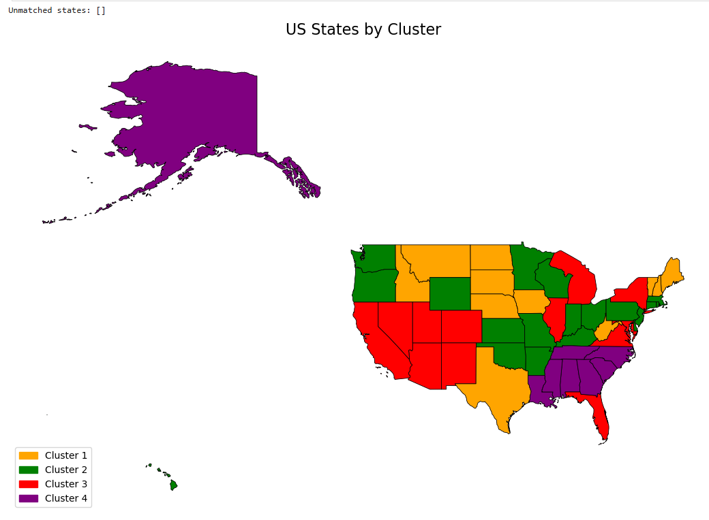
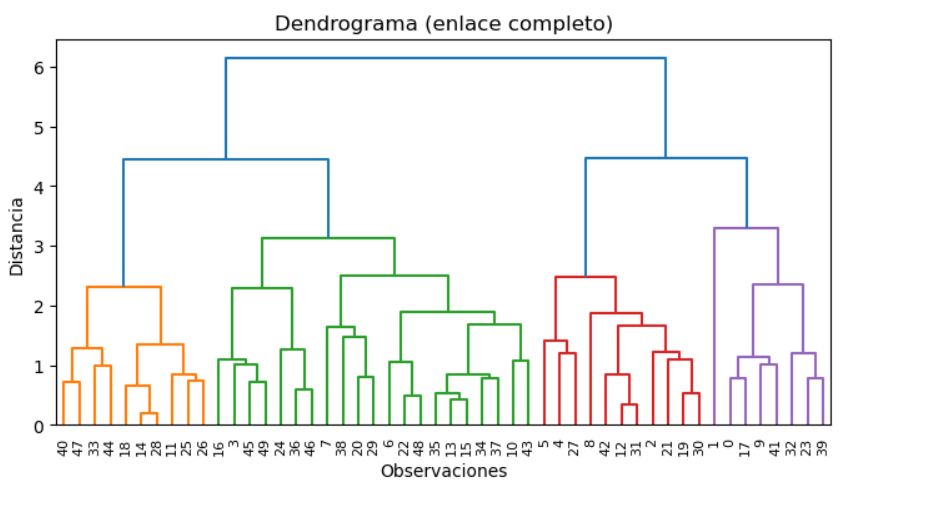
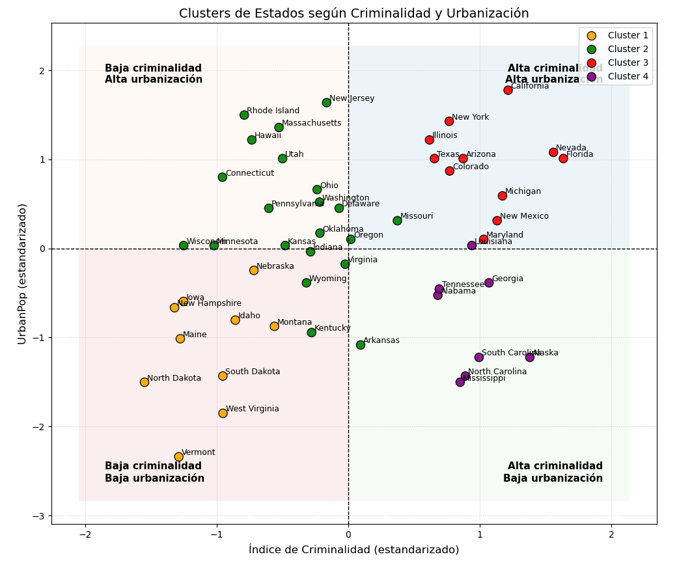
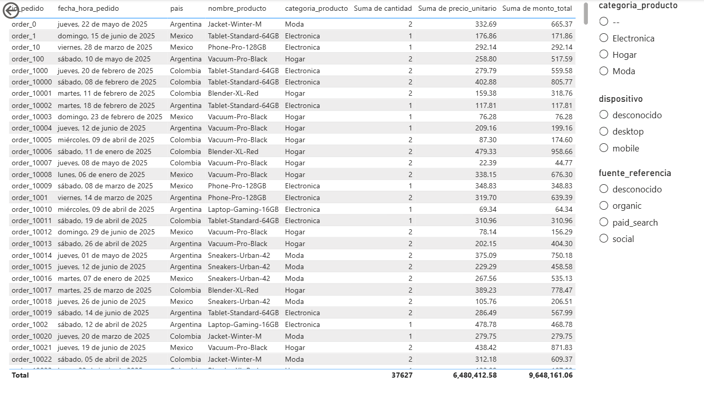
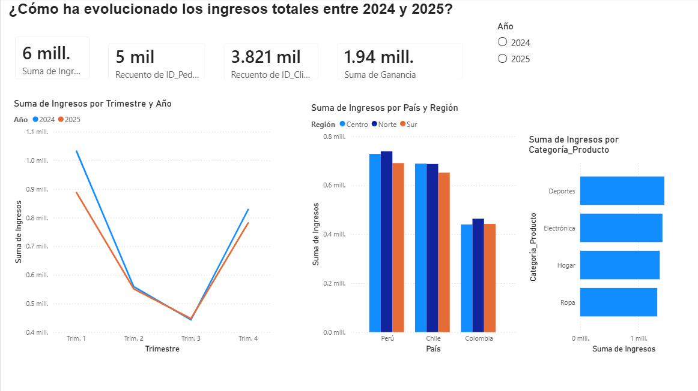
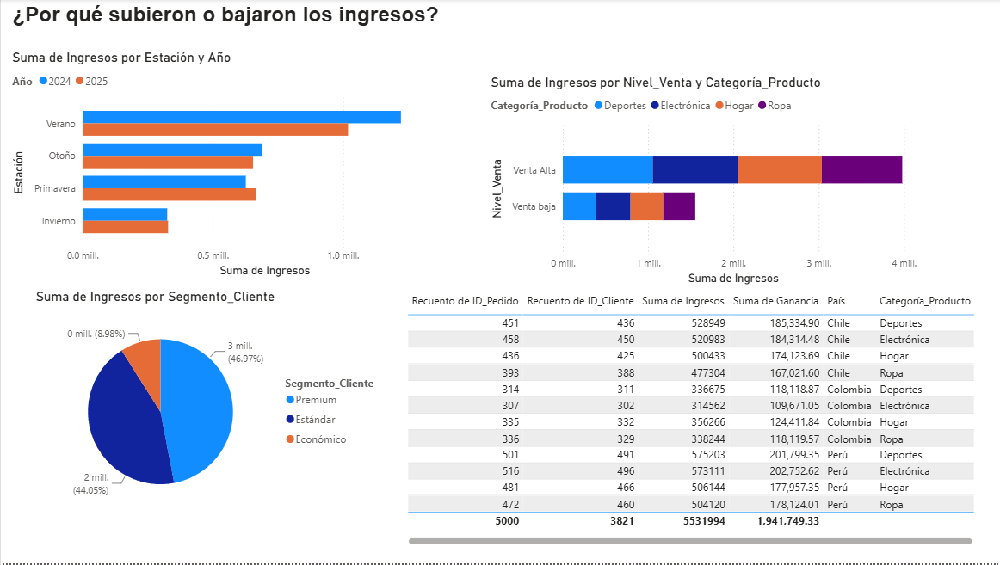
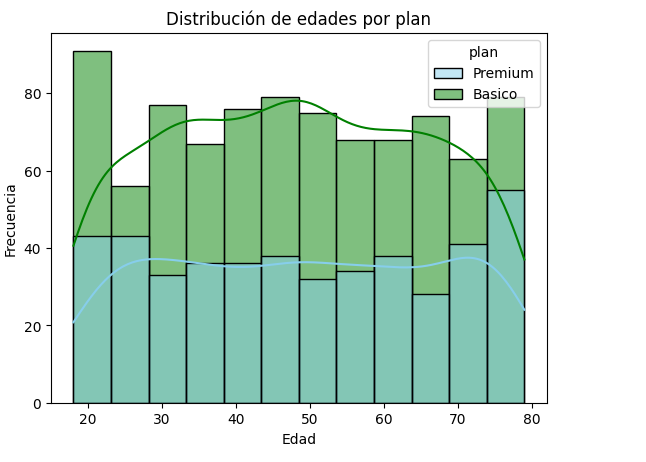
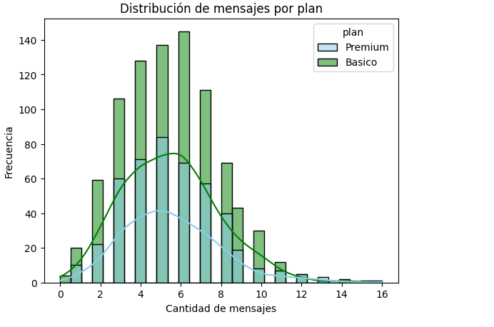
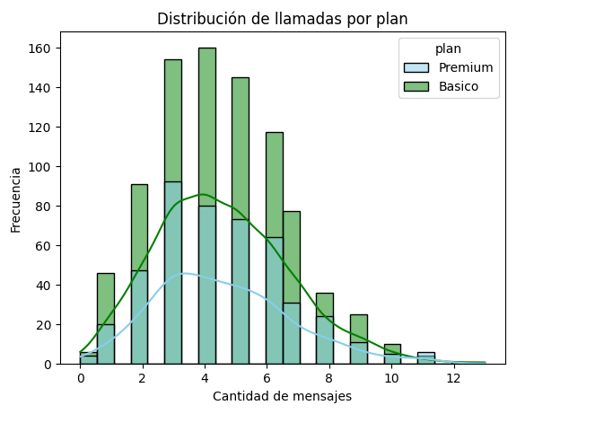
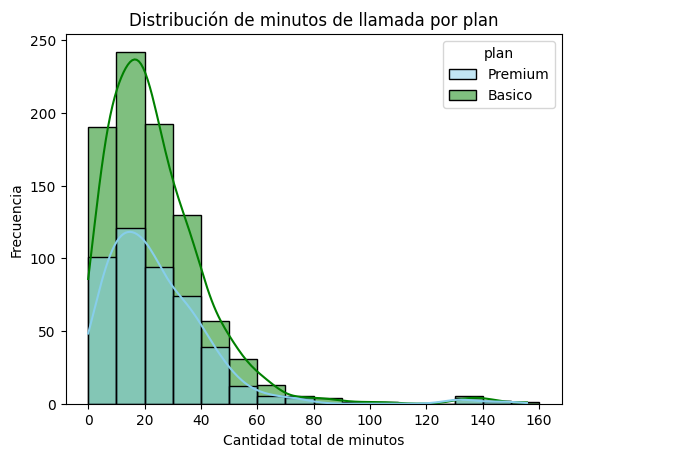

# 👨‍💻 Angel Felix Velarde | Portfolio


---

## 🎯 Portada

##Licenciado en Física / Physics Degree | Data Scientist | Data Analyst

Especializado en ciencia de datos, machine learning, análisis cuantitativo y business intelligence. Transformo datos complejos en soluciones prácticas e impactantes.

Diplomado en Estadística para Ciencia de datos.

---

## 📝 Sobre Mí

Soy licenciado en Física con un Diplomado en **Ciencia de Datos** y **Machine Learning**. Mi formación única combina:

- **Rigor Científico**: Simulaciones cuánticas, modelado computacional, física del estado sólido
- **Análisis de Datos**: Python, SQL, Machine Learning, estadística avanzada, Power BI
- **Pensamiento Estratégico**: Resolución de problemas complejos con datos

### Mi Valor Único

Entiendo tanto la teoría matemática profunda como la aplicación práctica en industria. Puedo traducir problemas empresariales en modelos cuantitativos y soluciones de datos, ya sea construyendo un modelo predictivo o un dashboard ejecutivo.

### Habilidades Técnicas

**Lenguajes:**
- Python (avanzado)
- SQL
- Inglés (B2)

**Machine Learning & Data Science:**
- Linear/Logistic Regression
- Clustering (K-means, Hierarchical)
- Feature Engineering
- Normalización & Scaling
- One-Hot Encoding

**Data Analysis & BI:**
- Detección y tratamiento de outliers (Método IQR)
- Limpieza de valores nulos, sentinels y fechas inválidas
- Análisis de valores MAR (Missing At Random)
- Segmentación de clientes (Rule-based & demográfica)
- Funnel de conversión y retención por cohortes (SQL)
- A/B Testing (pruebas de hipótesis)
- Modelado de datos y DAX (Power BI)
- EDA (Exploratory Data Analysis)

**Herramientas & Librerías:**
- scikit-learn
- Pandas
- NumPy
- Matplotlib & Seaborn
- statsmodels
- Power BI
- Streamlit (Web Apps)
- Jupyter Notebook

**Metodología:**
- EDA (Exploratory Data Analysis)
- Data Wrangling & Cleaning
- Model Evaluation & Metrics
- Git & Version Control

---

## 📂 Proyectos

<div>
  <button class="tab-btn active" onclick="showTab('ds')" id="btn-ds">🔬 Data Science</button>
  <button class="tab-btn" onclick="showTab('da')" id="btn-da">📊 Data Analysis / BI</button>
</div>

<style>
.tab-btn {
  font-family: -apple-system, BlinkMacSystemFont, "Segoe UI", Helvetica, Arial, sans-serif;
  font-weight: 600;
  font-size: 15px;
  padding: 10px 22px;
  margin: 0 8px 24px 0;
  border-radius: 999px;
  border: 2px solid #667eea;
  background: transparent;
  color: #667eea;
  cursor: pointer;
  transition: all 0.15s ease-in-out;
}
.tab-btn:hover {
  background: rgba(102, 126, 234, 0.1);
}
.tab-btn.active {
  background: #667eea;
  color: #ffffff;
}
#btn-da { border-color: #10b981; color: #10b981; }
#btn-da:hover { background: rgba(16, 185, 129, 0.1); }
#btn-da.active { background: #10b981; color: #ffffff; }
.tab-pane { display: none; }
.tab-pane.active { display: block; }
</style>

<script>
function showTab(tab) {
  var ds = document.getElementById('tab-ds');
  var da = document.getElementById('tab-da');
  var btnDs = document.getElementById('btn-ds');
  var btnDa = document.getElementById('btn-da');
  if (tab === 'ds') {
    ds.classList.add('active'); da.classList.remove('active');
    btnDs.classList.add('active'); btnDa.classList.remove('active');
  } else {
    da.classList.add('active'); ds.classList.remove('active');
    btnDa.classList.add('active'); btnDs.classList.remove('active');
  }
}
</script>

<div id="tab-ds" class="tab-pane active">

<h3>1️⃣ Car Price Prediction - Machine Learning Model</h3>

<p><strong>Descripción:</strong><br>
Aplicación web que predice precios de automóviles semi-nuevos usando regresión lineal. Implementé el pipeline completo: limpieza de datos, feature engineering, normalización y despliegue en producción.</p>

<p><strong>Logros Principales:</strong></p>
<ul>
<li>Procesé 2,900+ registros de datos reales</li>
<li>Creé 40+ características mediante One-Hot Encoding</li>
<li>RMSE normalizado: ~0.15-0.20</li>
<li>Aplicación activa en Streamlit Cloud</li>
</ul>

<p><strong>Stack Tecnológico:</strong></p>
<ul>
<li>Python, scikit-learn, Pandas, NumPy</li>
<li>StandardScaler, One-Hot Encoding</li>
<li>Linear Regression</li>
<li>Streamlit (Frontend)</li>
</ul>

<p><strong>Procesos Clave:</strong></p>
<ol>
<li>Limpieza: Eliminación de valores faltantes, conversión de formatos</li>
<li>Feature Engineering: Creación de variable "Turbo_status"</li>
<li>Tratamiento de Outliers: Método 3σ</li>
<li>Normalización: StandardScaler para X e y</li>
<li>Modelado: Linear Regression con split 80/20</li>
<li>Deployment: Streamlit Cloud</li>
</ol>

<p><strong>Links:</strong></p>
<ul>
<li>🚗 <a href="https://regresioncarrosangel-dwdr7sjni26n6rnf332k5v.streamlit.app/">Ver Aplicación en Vivo</a></li>
<li>💻 <a href="https://github.com/AngelFelixV/RegresionCarros_Angel">Código en GitHub</a></li>
</ul>

<p><strong>Aprendizajes:</strong></p>
<ul>
<li>La limpieza de datos es 80% del trabajo</li>
<li>Feature engineering > cantidad de features</li>
<li>Valores por defecto inteligentes mejoran predicciones</li>
<li>Normalización es crítica para regresión lineal</li>
</ul>

<hr>

<h3>2️⃣ Cluster Analysis - Machine Learning Homework</h3>

<p><strong>Descripción:</strong><br>
Proyecto académico para practicar clustering con Machine Learning. Implementé algoritmos de agrupamiento, análisis de resultados y visualizaciones profesionales.</p>

<p><strong>Logros Principales:</strong></p>
<ul>
<li>Implementé múltiples algoritmos de clustering</li>
<li>Análisis comparativo de resultados</li>
<li>Visualizaciones claras e interpretables</li>
<li>Evaluación de modelos con métricas adecuadas</li>
</ul>

<p><strong>Stack Tecnológico:</strong></p>
<ul>
<li>Python, scikit-learn, Pandas</li>
<li>Matplotlib, Seaborn (visualización)</li>
<li>Algoritmos: K-means, Hierarchical Clustering</li>
</ul>

<p><strong>Procesos Clave:</strong></p>
<ol>
<li>Preparación de datos</li>
<li>Escalado de features</li>
<li>Determinación de número óptimo de clusters</li>
<li>Entrenamiento de modelos</li>
<li>Evaluación y comparación</li>
<li>Visualización de resultados</li>
</ol>

<p><br>
Mapa de clustering mediante Dendrograma</p>

<p><br>
Dendrograma</p>

<p><br>
Gráfica de relación entre la métrica de criminalidad y la población urbana</p>

<p><br>
Mapa generado mediante la utilización de K-Means</p>

<p><strong>Links:</strong></p>
<ul>
<li>💻 <a href="https://github.com/AngelFelixV/ClusterAnalysis_Homework">Código en GitHub</a></li>
</ul>

<p><strong>Aprendizajes:</strong></p>
<ul>
<li>Diferentes algoritmos para diferentes tipos de datos</li>
<li>Importancia de normalización en clustering</li>
<li>Interpretabilidad de resultados</li>
<li>Visualización efectiva de clusters</li>
</ul>

</div>

<div id="tab-da" class="tab-pane">

<h3>1️⃣ Proyecto RappiPlus - Análisis Integral de Negocio (Proyecto Final TripleTen)</h3>

<p><strong>Descripción:</strong><br>
Proyecto final del programa de Data Analyst en TripleTen. Análisis integral de negocio para RappiPlus (servicio de suscripción de delivery): limpieza de datos, rentabilidad, funnel de conversión, retención por cohortes, test A/B y dashboard interactivo en Power BI.</p>

<p><strong>Logros Principales:</strong></p>
<ul>
<li>Validé la calidad de datos y traté nulos, duplicados y outliers en múltiples datasets</li>
<li>Calculé revenue, costo, profit y margen: negocio rentable con ~30.5% de margen</li>
<li>Medí el funnel de conversión con SQL: conversión total del 80.04%</li>
<li>Analicé retención por cohortes semanales (~41-44% estable en las primeras 3 semanas)</li>
<li>Ejecuté un test A/B (z-test de dos proporciones) sobre un rediseño de checkout</li>
<li>Construí un dashboard en Power BI con vista Overview Ejecutivo y Detalle/Drill-through</li>
</ul>

<p><strong>Stack Tecnológico:</strong></p>
<ul>
<li>Python (pandas, numpy)</li>
<li>SQL (PostgreSQL vía SQLAlchemy)</li>
<li>statsmodels (A/B testing)</li>
<li>Power BI (modelado de datos y DAX)</li>
</ul>

<p><strong>Procesos Clave:</strong></p>
<ol>
<li>Calidad de datos: limpieza e imputación cruzada entre datasets</li>
<li>Rentabilidad del negocio: revenue, costo, profit, margen, KPIs de venta</li>
<li>Funnel de conversión: consultas SQL sobre eventos de usuario</li>
<li>Retención por cohortes: análisis semanal por mes de registro</li>
<li>Test A/B: prueba de dos proporciones sobre el checkout</li>
<li>Dashboard: modelo de datos, medidas DAX y dos vistas en Power BI</li>
</ol>

<p><strong>Hallazgos principales:</strong></p>
<ul>
<li>Revenue total de $9.65M, profit de $2.94M (margen ~30.5%)</li>
<li>~17.5% de los pedidos se vendieron por debajo del costo del producto</li>
<li>Mayor punto de fuga del funnel entre <em>begin_checkout</em> y <em>add_payment_info</em></li>
<li>El rediseño de checkout no mostró mejora estadísticamente significativa (p = 0.4161)</li>
</ul>

<p><strong>Links:</strong></p>
<ul>
<li>💻 <a href="https://github.com/AngelFelixV/Proyecto_Final_DA_TripleTen">Código en GitHub</a></li>
</ul>

<p><strong>Aprendizajes:</strong></p>
<ul>
<li>Comunicar hallazgos técnicos en términos de negocio (rentabilidad, funnel, retención)</li>
<li>Combinar Python, SQL y Power BI en un mismo flujo de análisis</li>
<li>La validez estadística de un experimento importa tanto como su resultado</li>
</ul>

<p><br>
Informe ejecutivo del proyecto RappiPlus</p>

<p><br>
Análisis de las métricas</p>

<hr>

<h3>2️⃣ Dashboard Comercial Inmobiliario - Grupo Andes</h3>

<p><strong>Descripción:</strong><br>
Proyecto de reporting en Power BI para TripleTen. Diseñé un modelo de datos en esquema de estrella y un reporte de tres páginas para el seguimiento comercial de ventas inmobiliarias.</p>

<p><strong>Logros Principales:</strong></p>
<ul>
<li>Construí un modelo de datos en esquema de estrella (star schema)</li>
<li>Desarrollé medidas DAX de time intelligence y columnas de cohortes</li>
<li>Entregué un reporte de tres páginas para el equipo comercial</li>
<li>Retroalimentación del revisor sin observaciones bloqueantes</li>
</ul>

<p><strong>Stack Tecnológico:</strong></p>
<ul>
<li>Power BI (modelado de datos, DAX)</li>
<li>Python / Jupyter Notebook (preparación de datos)</li>
</ul>

<p><strong>Procesos Clave:</strong></p>
<ol>
<li>Diseño del modelo de datos en esquema de estrella</li>
<li>Construcción de tablas de dimensión y hecho</li>
<li>Medidas DAX: time intelligence y cohortes</li>
<li>Diseño del reporte de tres páginas</li>
<li>Revisión y ajustes finales</li>
</ol>

<p><strong>Links:</strong></p>
<ul>
<li>💻 <a href="https://github.com/AngelFelixV/DashboardInmobilario_GrupoAndes_TripleTen">Código en GitHub</a></li>
</ul>

<p><strong>Aprendizajes:</strong></p>
<ul>
<li>Diseño de modelos en esquema de estrella para reporting eficiente</li>
<li>Medidas DAX reutilizables con convención de nombres consistente</li>
<li>Estructurar un reporte multi-página pensado para el usuario final</li>
</ul>

<p><br>
Informe ejecuto del proyecto Grupo Andes</p>

<p><br>
Análisis de las métricas de Grupo Andes</p>

<hr>

<h3>3️⃣ Análisis de Clientes - ConnectaTel (Telecomunicaciones LATAM)</h3>

<p><strong>Descripción:</strong><br>
Proyecto de análisis de datos para una empresa de telecomunicaciones latinoamericana. Evalué el comportamiento de clientes mediante limpieza avanzada de datos, detección de outliers, segmentación por uso y edad, y síntesis de hallazgos para stakeholders.</p>

<p><strong>Logros Principales:</strong></p>
<ul>
<li>Detecté y corregí valores sentinela, nulos estructurales y fechas inválidas en 3 datasets</li>
<li>Clasifiqué valores nulos como MAR (Missing At Random) evitando imputaciones erróneas</li>
<li>Segmenté clientes por nivel de uso (Bajo / Medio / Alto) y grupo etario (Joven / Adulto / Adulto Mayor)</li>
<li>Eliminé outliers con el método IQR y validé el impacto en las distribuciones</li>
<li>Redacté un análisis ejecutivo con recomendaciones accionables para el negocio</li>
</ul>

<p><strong>Stack Tecnológico:</strong></p>
<ul>
<li>Python, Pandas, NumPy</li>
<li>Matplotlib, Seaborn (visualización)</li>
<li>Jupyter Notebook</li>
</ul>

<p><strong>Procesos Clave:</strong></p>
<ol>
<li>Carga y exploración de 3 datasets (<code>plans</code>, <code>users</code>, <code>usage</code>)</li>
<li>Detección de nulos, sentinelas y fechas fuera de rango</li>
<li>Limpieza y estandarización de datos</li>
<li>Aggregation por usuario (mensajes, llamadas, minutos)</li>
<li>Detección y eliminación de outliers (método IQR)</li>
<li>Segmentación rule-based por uso y edad</li>
<li>Visualización de distribuciones y segmentos</li>
<li>Síntesis ejecutiva para stakeholders</li>
</ol>

<p><br>
Distribución de edades por plan — sin sesgo marcado; el plan Básico predomina en todos los rangos etarios.</p>

<p><br>
Distribución de mensajes por plan — sesgo a la derecha; mayoría de usuarios envía entre 3 y 7 mensajes.</p>

<p><br>
Distribución de llamadas por plan — sesgo a la derecha; mayoría realiza entre 3 y 6 llamadas.</p>

<p><br>
Distribución de minutos de llamada por plan — fuerte sesgo a la derecha; mayoría consume menos de 40 minutos.</p>

<p><strong>Links:</strong></p>
<ul>
<li>💻 <a href="https://github.com/AngelFelixV/telecom-analysis-tripleten">Código en GitHub</a></li>
</ul>

<p><strong>Aprendizajes:</strong></p>
<ul>
<li>Tratamiento de nulos MAR vs. errores reales de captura</li>
<li>Importancia de validar fechas y detectar sentinelas antes del análisis</li>
<li>Segmentación rule-based como alternativa interpretable al clustering</li>
<li>Comunicación de hallazgos técnicos en lenguaje de negocio</li>
</ul>

</div>

## 📞 Datos de Contacto

| Medio | Información |
|-------|-------------|
| **📧 Email** | [angelfelixvelarde@gmail](mailto:angelfelixvelarde@gmail.com) |
| **🔗 LinkedIn** | [Angel Felix Velarde](https://www.linkedin.com/in/angel-felix-velarde-250480387/) |
| **💻 GitHub** | [@AngelFelixV](https://github.com/AngelFelixV) |
| **📍 Ubicación** | Culiacán, Sinaloa, México |

---

## 🎓 Educación

| Programa | Institución | Período |
|----------|-------------|---------|
| **Diplomado en Estadística para Ciencia de Datos** | Universidad Autónoma de Sinaloa | Sep 2025 - Feb 2026 |
| **Licenciatura en Física** | Universidad Autónoma de Sinaloa | Ago 2018 - Ene 2025 |

---

## 🌐 Presencia en Línea

- **GitHub:** [github.com/AngelFelixV](https://github.com/AngelFelixV) - Todos mis proyectos públicos
- **LinkedIn:** [angel-felixvelarde-250480387](https://www.linkedin.com/in/angel-felixvelarde-250480387/) - Conexiones profesionales
- **Streamlit Cloud:** [Car Price Predictor App](https://regresioncarrosangel-dwdr7sjni26n6rnf332k5v.streamlit.app/) - App en producción

---

## 🚀 Próximos Proyectos

- [ ] Análisis exploratorio avanzado (EDA) con visualizaciones interactivas
- [ ] Modelo de clasificación con múltiples algoritmos

---

## 💼 Experiencia & Fortalezas

**Fortalezas Técnicas:**
✅ Análisis profundo de datos  
✅ Diseño de modelos básicos de ML
✅ Business Intelligence y dashboards ejecutivos
✅ Código limpio y documentado  
✅ Solución de problemas complejos  
✅ Comunicación de resultados técnicos  

**Soft Skills:**
✅ Pensamiento analítico  
✅ Aprendizaje autónomo  
✅ Atención al detalle  
✅ Documentación profesional  
✅ Colaboración efectiva  

---

## 📊 Estadísticas

```
Proyectos Completados:     5+
Líneas de Código (Python): 5,000+
Modelos Entrenados:        10+
Dashboards en Power BI:    2
Apps en Producción:        1 (Streamlit)
Lenguajes:                 Python, SQL
Años de Experiencia:       1+ (en crecimiento)
```

---

## 🎯 Objetivo Profesional

Busco oportunidades donde pueda aplicar mi combinación única de conocimiento científico profundo + experiencia práctica en Data Science y Data Analytics para:

- Crear modelos predictivos impactantes
- Transformar datos en decisiones empresariales
- Construir dashboards y reportes que faciliten la toma de decisiones
- Contribuir a proyectos de investigación aplicada
- Crecer continuamente en Machine Learning y AI

---

## 📄 Última Actualización

**Julio 2026** | Portafolio versión 2.1

---

### 🙏 Gracias por visitar mi portafolio

Si tienes preguntas, propuestas de proyectos o simplemente quieres conectar, ¡no dudes en contactarme!

**email:** [angelfelixvelarde@gmail.com](mailto:angelfelixvelarde@gmail.com)  
**LinkedIn:** [https://www.linkedin.com/in/angel-felixvelarde-250480387/](https://www.linkedin.com/in/angel-felixvelarde-250480387/)
